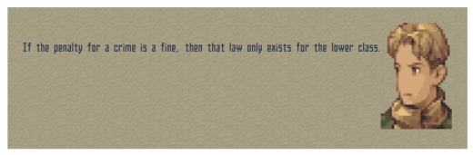

# fftactics_fonter

Just a simple exercise in css text handling based on Final Fantasy's Dialog box

Here's a preview of what it looks like:



I would like to work on this some more and integrate it with a THREEjs based game engine or something eventually.

## Project setup
```
npm install
```

### Compiles and hot-reloads for development
```
npm run serve
```

### Compiles and minifies for production
```
npm run build
```

### Lints and fixes files
```
npm run lint
```

### Customize configuration
See [Configuration Reference](https://cli.vuejs.org/config/).
